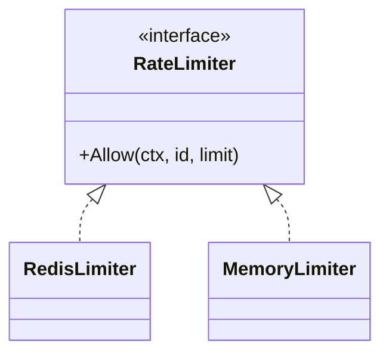
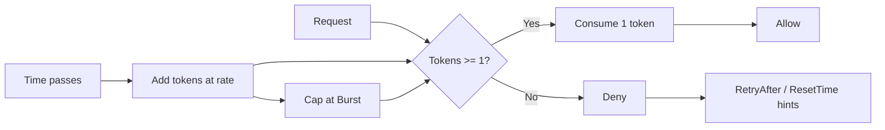
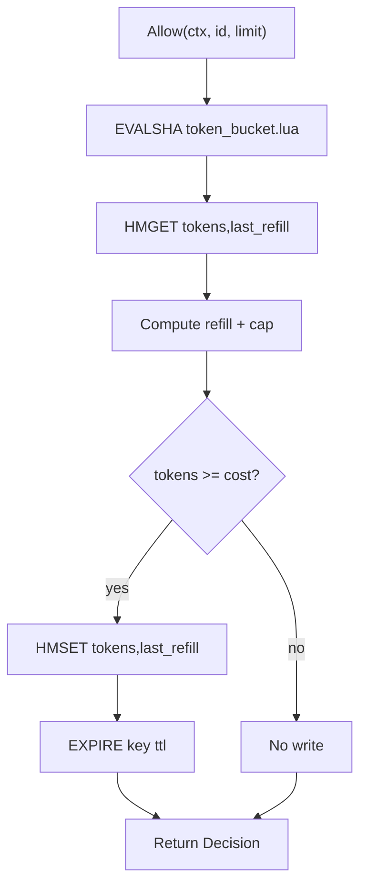
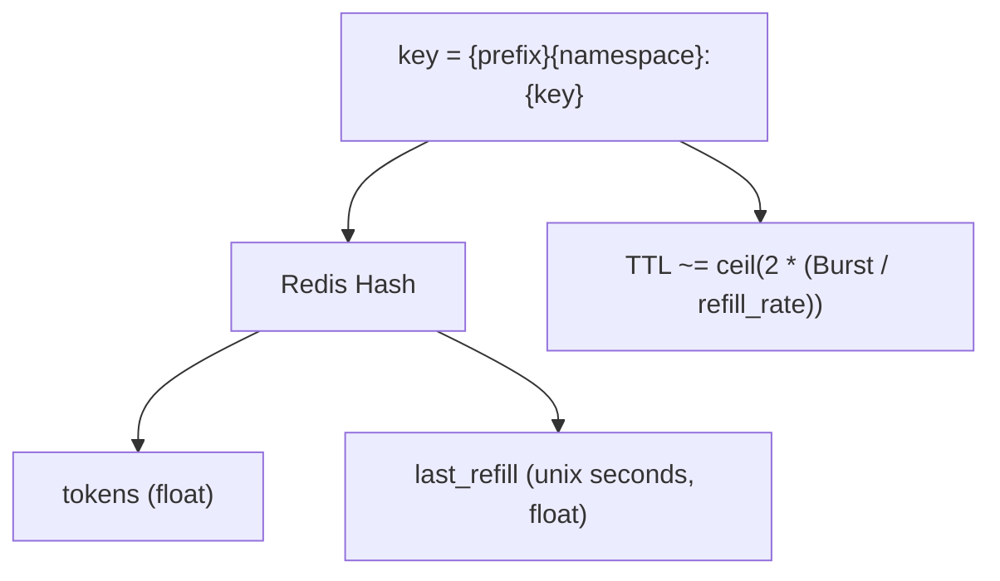
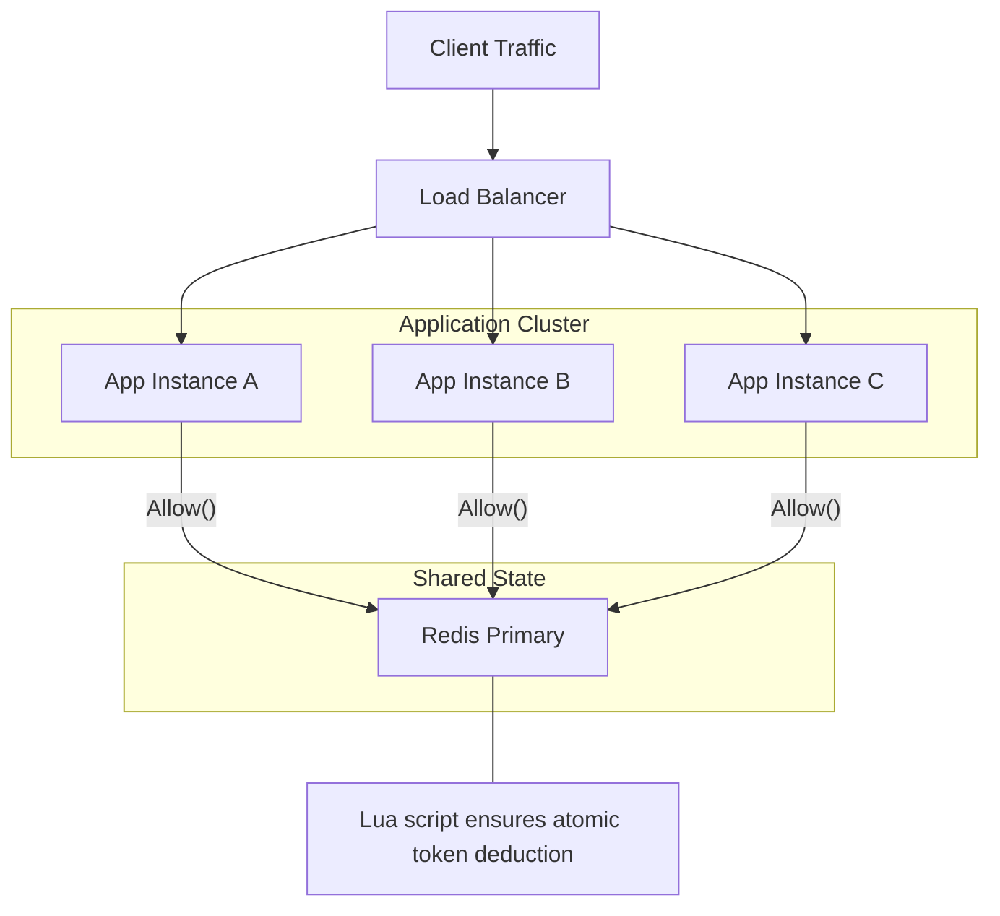
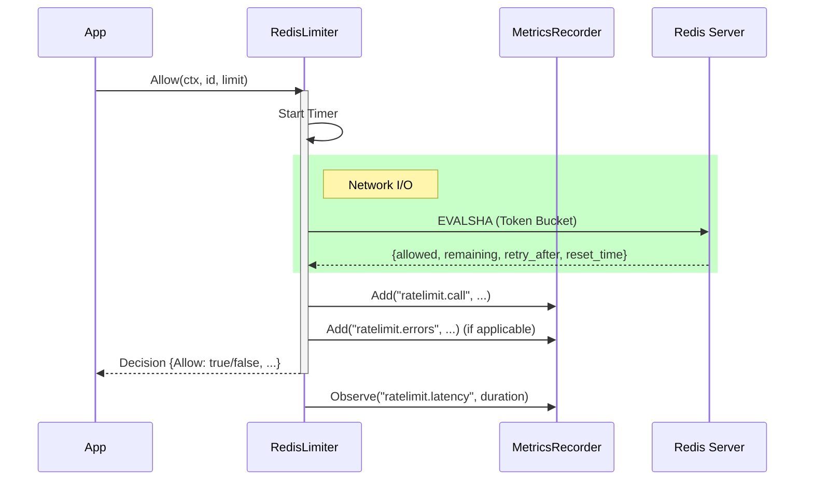

# Distributed Rate Limiter

[](https://goreportcard.com/report/github.com/manenim/gateway-rate-limiter) [](https://github.com/manenim/gateway-rate-limiter/actions/workflows/ci.yml) [](https://pkg.go.dev/github.com/manenim/gateway-rate-limiter)

A Redis-backed, distributed **Token Bucket** rate limiter for Go.

This repo ships:

- A reusable library (`pkg/limiter`) with a small, testable API
- A Redis Lua script embedded in the binary for atomic token-bucket updates
- A runnable example server (`cmd/example-server`)
- Mermaid diagrams in `docs/`

## Contents

- [Distributed Rate Limiter](#distributed-rate-limiter)
  - [Contents](#contents)
  - [Features](#features)
  - [Requirements](#requirements)
  - [Installation](#installation)
  - [Quick start (Redis-backed)](#quick-start-redis-backed)
  - [API at a glance](#api-at-a-glance)
    - [Core types](#core-types)
    - [Interface + implementations](#interface--implementations)
    - [Redis key format](#redis-key-format)
  - [Usage patterns](#usage-patterns)
    - [In-memory limiter (tests / single-instance)](#in-memory-limiter-tests--single-instance)
    - [HTTP integration (returning 429)](#http-integration-returning-429)
    - [Fail open vs fail closed](#fail-open-vs-fail-closed)
  - [Configuration](#configuration)
  - [Observability (metrics)](#observability-metrics)
  - [How it works](#how-it-works)
    - [Token bucket (conceptual)](#token-bucket-conceptual)
    - [Redis atomic update (implementation)](#redis-atomic-update-implementation)
    - [Redis data model](#redis-data-model)
  - [Architecture](#architecture)
  - [Sequence](#sequence)
  - [Example server](#example-server)
  - [Docker](#docker)
  - [Testing](#testing)

## Features

- **Redis-backed distributed state**: enforce one global limit across many app instances.
- **Atomicity via Lua**: token refill + deduction happens server-side as a single atomic operation.
- **Context cancellation support**: caller controls timeouts/deadlines for `Allow()`.
- **Pluggable metrics**: bring your own Prometheus/DataDog/Otel adapter via a tiny interface.
- **In-memory implementation**: dependency-free `MemoryLimiter` for tests and local dev.

## Requirements

- Go `1.24.5` (see `go.mod`)
- Redis (only required for `RedisLimiter`; `MemoryLimiter` is dependency-free)

## Installation

```bash
go get github.com/manenim/gateway-rate-limiter
```

Import the library package:

```go
import "github.com/manenim/gateway-rate-limiter/pkg/limiter"
```

If you prefer to be explicit about versions:

```bash
go get github.com/manenim/gateway-rate-limiter@latest
```

## Quick start (Redis-backed)

```go
client := redis.NewClient(&redis.Options{Addr: "localhost:6379"})

l, err := limiter.NewRedisLimiter(
    client,
    limiter.WithPrefix("myapp:"), // Redis key prefix (optional)
)
if err != nil {
    // Redis unreachable or SCRIPT LOAD failed
    log.Fatal(err)
}

id := limiter.Identity{Namespace: "user", Key: "123"}
limit := limiter.Limit{Rate: 10, Period: time.Second, Burst: 20}

dec, err := l.Allow(ctx, id, limit)
if err != nil {
    // Choose your policy: fail-open (availability) or fail-closed (protection)
    return
}
if !dec.Allow {
    // e.g., in HTTP: return 429
    return
}
```

> Note: Each `Allow()` call currently has a fixed cost of **1 token**.

## API at a glance

### Core types

- `Limit{Rate, Period, Burst}`: policy definition (tokens per `Period`, with max capacity `Burst`).
- `Identity{Namespace, Key}`: who you are rate limiting (user, api key, ip, tenant, ...).
- `Decision{Allow, Remaining, RetryAfter, ResetTime}`: result + timing hints for callers.

### Interface + implementations



### Redis key format

By default, Redis keys are:

```
limiter:<namespace>:<key>
```

You can override the prefix via `WithPrefix("myapp:")`.

## Usage patterns

### In-memory limiter (tests / single-instance)

```go
l := limiter.NewMemoryLimiter()

id := limiter.Identity{Namespace: "user", Key: "123"}
limit := limiter.Limit{Rate: 10, Period: time.Second, Burst: 10}

dec, err := l.Allow(context.Background(), id, limit)
if err != nil {
    panic(err)
}
_ = dec
```

### HTTP integration (returning 429)

```go
// Optional: put an upper-bound on Redis time per request.
ctx, cancel := context.WithTimeout(r.Context(), 50*time.Millisecond)
defer cancel()

dec, err := l.Allow(ctx, id, limit)
if err != nil {
    // Choose your policy:
    // - fail closed: w.WriteHeader(429/503); return
    // - fail open: continue to serve the request
}
if !dec.Allow {
    // Retry-After uses whole seconds in HTTP; rounding up is typical.
    w.Header().Set("Retry-After", fmt.Sprintf("%.0f", math.Ceil(dec.RetryAfter.Seconds())))
    w.WriteHeader(http.StatusTooManyRequests)
    return
}
```

### Fail open vs fail closed

This library returns errors; it does not force a policy. In your application you typically pick:

- **Fail closed** when you must protect an upstream (strict quota enforcement).
- **Fail open** when availability matters more than perfect limiting.

## Configuration

`NewRedisLimiter` uses the functional options pattern:

```go
l, err := limiter.NewRedisLimiter(
    client,
    limiter.WithPrefix("myapp:rate:"),
    limiter.WithTimeout(2*time.Second),
    limiter.WithRecorder(myMetrics),
)
```

Supported options:

- `WithPrefix(string)` (default: `limiter:`)
- `WithTimeout(time.Duration)` (default: `5s`, used by `NewRedisLimiter` during `PING` and `SCRIPT LOAD`)
- `WithRecorder(MetricsRecorder)` (default: `NoOpMetricsRecorder`)

## Observability (metrics)

To avoid locking you into a specific telemetry stack, the library exposes a tiny interface:

```go
type MetricsRecorder interface {
    Add(name string, value float64, tags map[string]string)
    Observe(name string, value float64, tags map[string]string)
}
```

The Redis-backed limiter emits:

- Counter: `ratelimit.call` with tags `{namespace, status=allowed|denied}`
- Counter: `ratelimit.errors` with tags `{namespace, type=redis_eval|invalid_format}`
- Histogram/Distribution: `ratelimit.latency` (seconds) with tags `{namespace, status=allowed|denied|error}`

`MetricsRecorder` methods are called inline as part of `Allow()`. Keep your implementation fast (or make it non-blocking) to avoid adding latency to admission checks.

## How it works

### Token bucket (conceptual)

`Limit` is a token-bucket policy:

- Refill rate: `Rate / Period` tokens per second
- Capacity: `Burst` tokens
- Cost per request: `1` token



### Redis atomic update (implementation)

For each `Allow()` call, the limiter runs an embedded Lua script via `EVALSHA`:

- Reads `{tokens, last_refill}` for the identity
- Computes refill since `last_refill`
- Deducts `cost=1` if possible
- Writes the updated state (on allow) and sets a TTL to avoid key leaks
- Returns `{allowed, remaining, retry_after, reset_time}`



### Redis data model

Each identity maps to a single Redis key holding a hash:



## Architecture

Full diagram: `docs/architecture.md`



## Sequence

Full diagram: `docs/sequence.md`



## Example server

The repo includes a minimal HTTP server that demonstrates how to apply the limiter to an endpoint:

- Entry point: `cmd/example-server/main.go`
- Endpoint: `GET /ping`
- Identity: `Namespace="ip"`, `Key=r.RemoteAddr` (demo choice)
- Env var: `REDIS_ADDR` (default `localhost:6379`)

Run locally:

```bash
docker run --rm -p 6379:6379 redis:7-alpine
REDIS_ADDR=localhost:6379 go run ./cmd/example-server
curl -i http://localhost:8080/ping
```

## Docker

Build the example server image:

```bash
docker build -t rate-limiter-example .
```

Run Redis + the example server on a shared Docker network:

```bash
docker network create rl-demo || true
docker run -d --name rl-redis --network rl-demo redis:7-alpine

docker run --rm --network rl-demo -p 8080:8080 \
  -e REDIS_ADDR=rl-redis:6379 \
  rate-limiter-example
```

## Testing

Run unit tests:

```bash
go test ./...
```

Redis integration tests will automatically skip if Redis is not reachable at `localhost:6379`.

