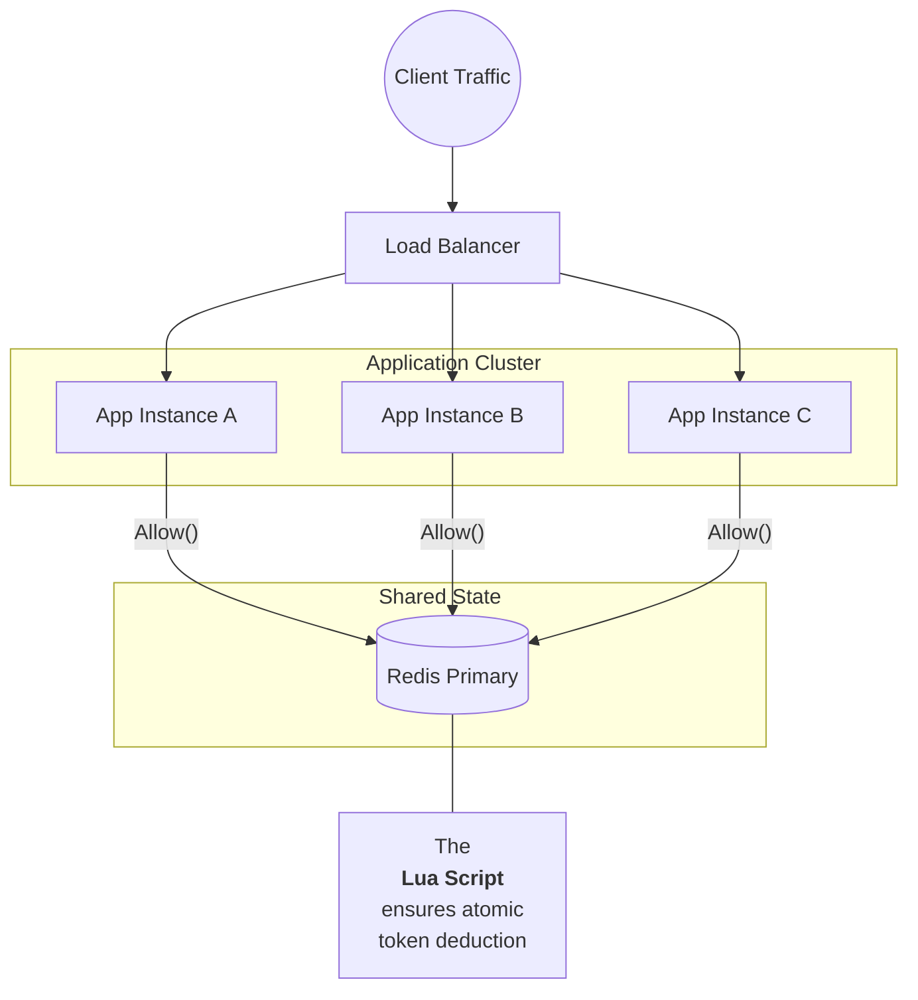

# System Architecture

How the Distributed Rate Limiter works across multiple nodes.

```mermaid
graph TD
    Client((Client Traffic)) --> LB[Load Balancer]
    
    subgraph "Application Cluster"
        NodeA[App Instance A]
        NodeB[App Instance B]
        NodeC[App Instance C]
    end
    
    LB --> NodeA
    LB --> NodeB
    LB --> NodeC
    
    subgraph "Shared State"
        Redis[(Redis Primary)]
    end
    
    NodeA -- "Allow()" --> Redis
    NodeB -- "Allow()" --> Redis
    NodeC -- "Allow()" --> Redis
    
    note[The <br/><b>Lua Script</b><br/> ensures atomic <br/>token deduction]
    Redis --- note
```
