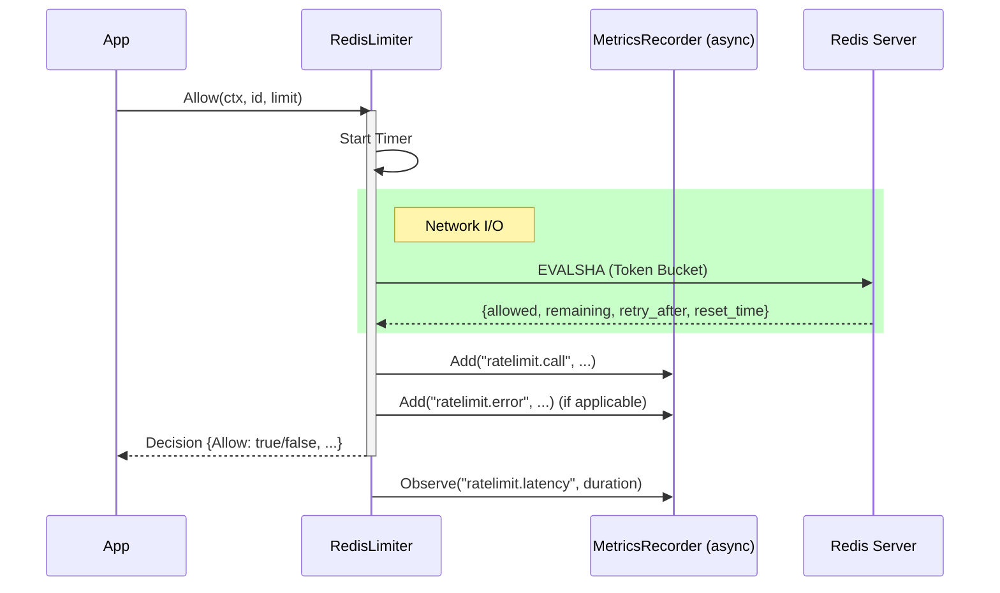

# Sequence Diagram

The flow of a single `Allow()` call.

```mermaid
sequenceDiagram
    participant App
    participant Limiter as RedisLimiter
    participant Metrics as MetricsRecorder (async)
    participant Redis as Redis Server
    
    App->>Limiter: Allow(ctx, id, limit)
    activate Limiter
    
    Limiter->>Limiter: Start Timer
    
    rect rgb(200, 255, 200)
    Note right of Limiter: Network I/O
    Limiter->>Redis: EVALSHA (Token Bucket)
    
    Redis-->>Limiter: {allowed, remaining, retry_after, reset_time}
    end
    
    Limiter->>Metrics: Add("ratelimit.call", ...)
    Limiter->>Metrics: Add("ratelimit.error", ...) (if applicable)
    
    Limiter-->>App: Decision {Allow: true/false, ...}
    
    deactivate Limiter
    Limiter->>Metrics: Observe("ratelimit.latency", duration)
```
